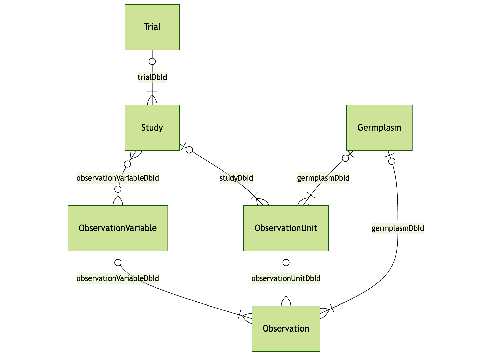

# API Documentation

MIRA offers several BrAPI endpoints, including Trial, Study, Germplasm, ObservationUnit, ObservationVariable, and Observation. These endpoints allow users to retrieve information via GET requests from the ARC, providing access to relevant data for research purposes.

<figure markdown="span">
  
  <figcaption>Entity Relationship Diagram of the BrAPI entities available in MIRA.</figcaption>
</figure>

**Find further information**

- [BrAPI-Phenotyping Specification](https://app.swaggerhub.com/apis/PlantBreedingAPI/BrAPI-Phenotyping/2.1)
- [BrAPI-Germplasm Specification](https://app.swaggerhub.com/apis/PlantBreedingAPI/BrAPI-Germplasm/2.1)
- [BrAPI-Core Specification](https://app.swaggerhub.com/apis/PlantBreedingAPI/BrAPI-Core/2.1)