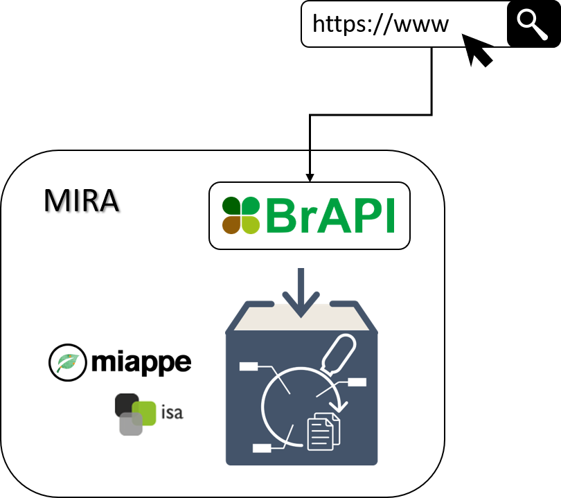

# Getting Started

## What is MIRA?

MIRA is a mediation service that allows to access research data stored in a FDO in form of an ARC, according to the recommendations of the MIAPPE standard via BrAPI endpoints. For this purpose, the ARC RO-Crate and the associated resources of the ARC are extracted and automatically transformed via an ISA-MIAPPE-BrAPI mapping so that they can be loaded from a BrAPI server.

<figure markdown="span">

  <figcaption>Architecture overview of MIRA.</figcaption>
</figure>

## Usage Guide

Before MIRA can be used, it should be checked whether the ARC fulfills all the requirements to be loaded successfully. All prerequisites are listed on the [ARC Prerequisites](arc-prerequisites) page. A subsequent FAQ collection provides starting points for solving issues.

### Docker Setup

**Prerequisites**

- Docker>=27
- Docker compose>=2.28

**Configure docker compose setup**
```yml linenums="1" title="docker-compose.yml"
services:
  mira:
    image: ghcr.io/ipk-bit/mira:latest
    ports:
      - 8000:8000
    volumes:
      - ./config.yml:/app/config.yml
```

**Configure instance**

```yml linenums="1" title="./config.yml"
format: 'arc'
data: <path-to-local-repo>
aai:
  - method: basic
    username: <username>
    password: <password>
server:
  contact: <contact-email>
  documentation: <documentation-url>
  location: <country>
  organization: 
    name: <organization-name>
    url: <organization-website>
  description: |
    <server-description>
  name: <server-name>
```

**Start container**
```bash
docker compose up -d
```

### From Source

**Prerequisities**

- Python>=3.12
- Poetry>=1.8

**Clone Repository**
```bash
git clone https://github.com/IPK-BIT/mira.git
```

**Install Dependencies**
```bash
poetry install
```

**Configure instance**

```yml linenums="1" title="./config.yml"
format: 'arc'
data: <path-to-local-repo>
aai:
  - method: basic
    username: <username>
    password: <password>
server:
  contact: <contact-email>
  documentation: <documentation-url>
  location: <country>
  organization: 
    name: <organization-name>
    url: <organization-website>
  description: |
    <server-description>
  name: <server-name>
```

**Start MIRA server**
```bash
cd mira
litestar run 
```

## How to Cite

- Feser, M. MIRA [Computer Software]. [https://github.com/IPK-BIT/mira](https://github.com/IPK-BIT/mira)